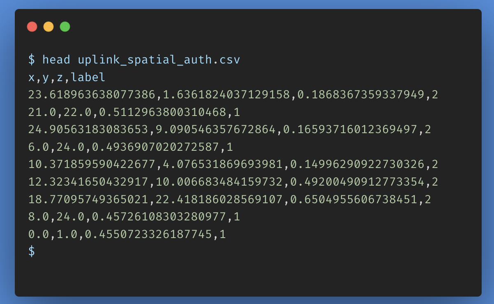
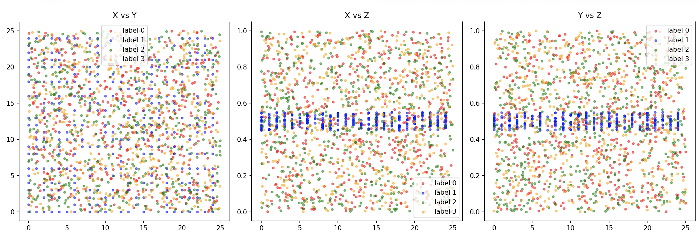
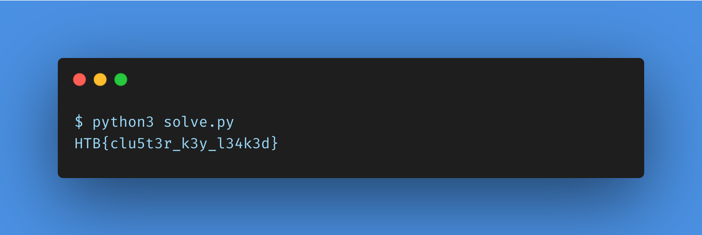

# Uplink Artifact - HTB AI/ML Challenge Writeup

**Difficulty:** Very Easy  
**Category:** AI/ML

## Summary
A CSV dataset of 3D spatial points with 4 label classes conceals a QR code.
Label 1 points, when mapped to a 2D integer grid, reconstruct a scannable QR 
code containing the flag.

## Vulnerability / Concept
Steganography via spatial data encoding. Access credentials are hidden as a QR 
code embedded inside a labeled point cloud dataset. The trick is that one label 
class encodes a pixel grid rather than actual data points.

---

## Walkthrough

### 1. Loading the data

The challenge gives us `uplink_spatial_auth.csv` with 1822 rows and 4 columns:
`x`, `y`, `z` are coordinates in 3D space, and `label` is a class (0, 1, 2, or 3).




```python
df = pd.read_csv("uplink_spatial_auth.csv")
print(df['label'].value_counts())
```

```
label
0    525
2    518
3    457
1    322
```

Nothing jumps out immediately, the classes are roughly balanced. Time to visualize.

### 2. Visualizing the data

```python
colors = {0: 'red', 1: 'blue', 2: 'green', 3: 'orange'}
fig, axes = plt.subplots(1, 3, figsize=(15, 5))

for label, group in df.groupby('label'):
    axes[0].scatter(group['x'], group['y'], c=colors[label], label=f'label {label}', alpha=0.5, s=10)
    axes[1].scatter(group['x'], group['z'], c=colors[label], label=f'label {label}', alpha=0.5, s=10)
    axes[2].scatter(group['y'], group['z'], c=colors[label], label=f'label {label}', alpha=0.5, s=10)

axes[0].set_title('X vs Y')
axes[1].set_title('X vs Z')
axes[2].set_title('Y vs Z')
```




Look at the X vs Z and Y vs Z plots. Label 1 (blue) forms a perfectly flat 
horizontal band at z ~0.5. Every other label is scattered randomly across the 
full z range (0 to 1). That is not natural, something is off about label 1.

### 3. Finding what makes label 1 different

Looking closer at label 1 rows in the raw data, the x and y values are always 
clean whole numbers like `6.0`, `24.0`, `8.0`. Every other label has messy 
floats like `23.618`, `10.371`, etc.

We can verify this programmatically:

```python
df['x_is_int'] = df['x'].apply(lambda v: float(v).is_integer())
df['y_is_int'] = df['y'].apply(lambda v: float(v).is_integer())
df['both_int'] = df['x_is_int'] & df['y_is_int']
print(df.groupby('both_int')['label'].value_counts())
```

```
both_int  label
False     0        525
          2        518
          3        457
True      1        322
```

Clean split, no overlap. If both x and y are integers, it is label 1. Always.
This means label 1 points live on a regular grid, which is exactly how pixels 
in an image work. Each point is basically a pixel coordinate.

### 4. Reconstructing the QR code

Since label 1 points are on an integer grid, we can paint them onto a 2D image.
Black pixel where a point exists, white where it doesn't:

```python
qr_df = df[df['label'] == 1].copy()
qr_df['x'] = qr_df['x'].round().astype(int)
qr_df['y'] = qr_df['y'].round().astype(int)
qr_df['x'] -= qr_df['x'].min()
qr_df['y'] -= qr_df['y'].min()

width = qr_df['x'].max() + 1
height = qr_df['y'].max() + 1
qr = np.zeros((height, width), dtype=int)

for _, row in qr_df.iterrows():
    qr[int(row['y']), int(row['x'])] = 1

plt.imshow(qr, cmap='gray_r', interpolation='nearest')
plt.savefig('qr.png')
```


That is a QR code.

### 5. Decoding the QR code

Rather than scanning it manually, we decode it in Python:

```python
from pyzbar.pyzbar import decode
from PIL import Image

result = decode(Image.open('qr.png'))
print(result[0].data.decode('utf-8'))
```




---

## Flag

```
HTB{clu5t3r_k3y_l34k3d}
```

---

## Takeaway
The dataset had 4 label classes but only one of them actually mattered. Label 1 
was not a data class, it was a hidden image. Its x and y values were always 
integers because they were pixel coordinates, and the z value was kept near 0.5 
to avoid standing out statistically.

The lesson here is that in any ML/data challenge, before training a model, look 
at the data. A simple scatter plot revealed everything. The pattern that broke 
it open was noticing that one label had suspiciously clean coordinates while 
everything else was noisy floats. That kind of inconsistency is almost always 
intentional.